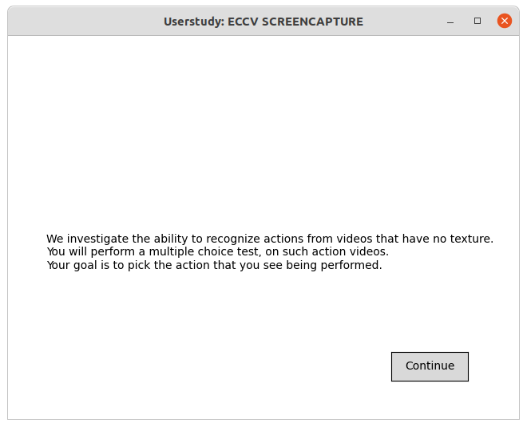
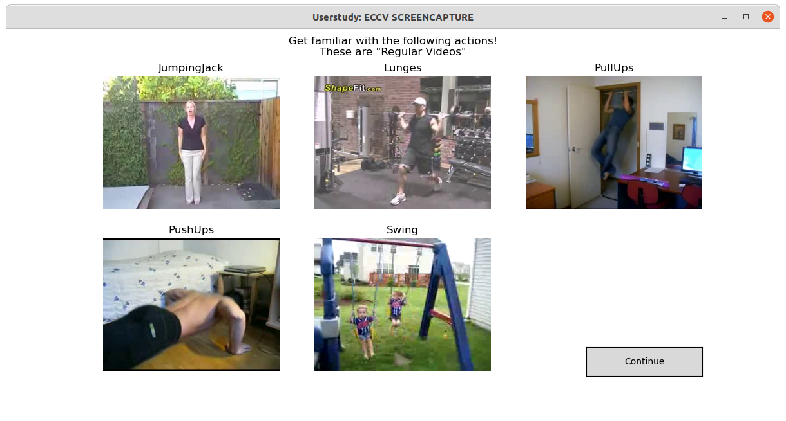
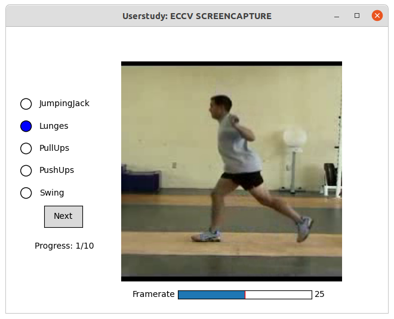
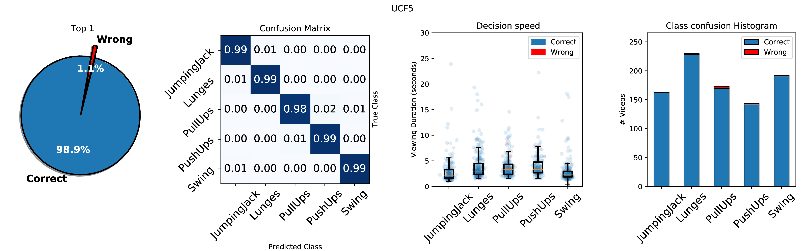
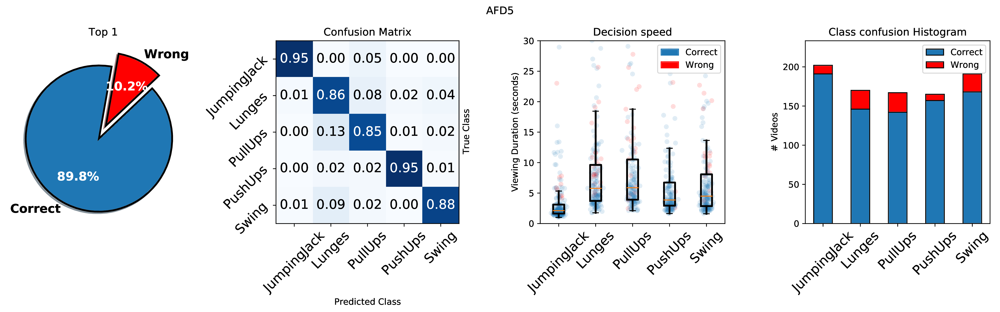

**Is Appearance Free Action Recognition Possible?**<br>
ECCV 2022<br>
Filip Ilic, Thomas Pock, Richard P. Wildes<br>

---

[[Project Page]](https://f-ilic.github.io/AppearanceFreeActionRecognition)

Environment Setup:
```bash
git clone --recurse-submodules git@github.com:f-ilic/AppearanceFreeActionRecognition.git
conda env create -f environment.yaml
conda activate motion
```

# Appearance Free Action Recognition


This repository consists of three distinct parts:
1) The Appearance Free Dataset (AFD), and the code to generate it.
AFD itself is a synthetic derivative of UCF101 where all appearance cues are removed such that only motion information remains. It is also a self-contained repository - https://github.com/f-ilic/afd - if you are only interested in the dataset.

2) Our poposed E2S-X3D network, including train & inference code.

3) The code for the psychophysical experiment, complete with a user interface, scripts to plot and summarize the gathered results as shown in our paper.


# Appearance Free Dataset
The Appearance Free Dataset (AFD) is an extension to a widely used action recognition dataset that
disentangles static and dynamic video components. In particular, no single frame
contains any static discriminatory information in AFD; the action is only encoded in the temporal dimension.

We provide the AFD101 dataset based on UCF101, and also the necessary tools to generate other appearance free videos.

Some samples from AFD101 are shown below:


## Download
Download link to AFD101: https://files.icg.tugraz.at/f/bcf621cd46ba4b0e8feb/


If you wish to download the whole dataset package, run:
```bash
wget https://files.icg.tugraz.at/f/41fb3577580f458ea997/?dl=1 -O ucf101.zip
wget https://files.icg.tugraz.at/f/bcf621cd46ba4b0e8feb/?dl=1 -O afd101.zip
unzip ucf101.zip
unzip afd101.zip
```

## Create it yourself

*Note: To run the following scripts `cd` into `afd/`*


To create it from scratch you need to

1) Download and extract ucf101

```
wget https://files.icg.tugraz.at/f/41fb3577580f458ea997/?dl=1 -O ucf101.zip
unzip ucf101
```

2) Run:
```python 
python generate_afd.py --src /path/to/ucf101/ --dst /some/path/
```

**Optional:**

If you want to save the individual frames instead, which leads to higher fidelity images due to the compression induced from mp4 and the fact that random noise is hard to compress you can pass the `-images` flag. Be aware that this will use around 300gb of space. This was <u>not</u> used in the paper.

```python 
python generate_afd.py --src /path/to/ucf101/ --dst /some/path/ -images
```

Both methods will populate `/some/path` with the AFD101 dataset.

*Hint:* For quick speedup if you have multiple GPUs:
```
CUDA_VISIBLE_DEVICES=0 python generate_afd.py --src /home/data/ucf101 --dst /home/data/afd101 --start_letter A --end_letter F
CUDA_VISIBLE_DEVICES=1 python generate_afd.py --src /home/data/ucf101 --dst /home/data/afd101 --start_letter F --end_letter J
CUDA_VISIBLE_DEVICES=2 python generate_afd.py --src /home/data/ucf101 --dst /home/data/afd101 --start_letter J --end_letter P
CUDA_VISIBLE_DEVICES=3 python generate_afd.py --src /home/data/ucf101 --dst /home/data/afd101 --start_letter P --end_letter Z
```

To generate the optical flow datasets needed for on demand dataloading run:
```python
python generate_flow.py --src /path/to/ucf101orafd101/ --dst /some/path/
```

 ## Visualisation & Utilities

We also provide some basic utilities to view AFD data in context of its optical flow and the (regular rgb) video. 
This is useful to see the streghts and weaknesses of AFD video.


 To visualize a (regular) video side by side of an appearance free version and the middleburry coded optical flow of said video, run:
 ```python
python afd_single_video.py /path/to/video.mp4
 ```


(click on gif or zoom in to get rid of the moreau pattern)


To save the result as a gif (as seen above):

 ```python
python afd_single_video.py /path/to/video.mp4 --gif /home/Desktop/test.gif
 ```


Furthermore if you want to extract AFD from already AFD video (😳) passt the flag `--upsample INT` so that RAFT can find correspondances more easily as 320x240 images are too small with /4 downscaling in RAFT. You can also try this if your videos have a small spatial resolution.

 ```python
python afd_single_video.py /path/to/afdvideo.mp4 --gif /home/Desktop/test.gif --upsample 2
 ```

 To create a collage of a few AFD videos as shown on top run:

 ```python 
 python afd_teaser_collage.py
 ```
 The output will be saved as `collage.gif`.

# Our proposed network: E2S-X3D

E2S-X3D is our proposed two stream architecture that relies on explict flow computed by RAFT and uses two (different) X3D backbones for the appearance / texture stream and the explict optical flow stream.

To check if you set up everything properly, test the dataloading:

```bash
PYTHONPATH='./' python dataset/db_factory.py
```
This should load samples, through which you can scrub with mousewheel up/down.


### Training / Inference

To reproduce the results run:
```bash
python train.py --datasetname afd101 --datasetname_motionpath afd101flow --num_epochs 400 --batch_size 10 --rgbarch x3d_m --flowarch x3d_s --num_workers 8 -train_backbone
```
You might need to adjust the `batch_size` parameter depending on your hardware.

To evaluate on ucf101 set:
```bash
--datasetname ucf101
--dataset_motionpath ucf101flow
```

and for afd101
```bash
--datasetname afd101
--dataset_motionpath afd101flow
```

The same holds for the ucf5/afd5 versions, if the datasets are located in `data/`

You do not have to set the `num_frames x sampling rate` individually, it is instead determined automatically depending on the chosen architecture. If you want to adjust this, look at the file: `dataset/TwoStreamucf101.py`

<i>NOTE: During E2S-X3D training optical flow is not computed on the fly but is rather loaded from disk to reduce computational overhead. 
Follow the instructions above to save the optical flow files to be loaded from disk.</i>


# Psychophysical Experiment
The psychophysical experiment is performed on `UCF5/AFD5`.
Create the `UCF5/AFD5` datasets by copying the following classes from their 101 counterparts into directories named `data/ucf5/<ACTION>` and `data/afd5/<ACTION>`.

```
JumpingJack 
Lunges
PullUps
PushUps
Swing
```


Then run the Trial UI:
```python
PYTHONPATH='./' python trial/AppearanceFreeTrial.py
```

This will start the matplotlib UI which is used for the userstudy.
It gives instructions and guides you through the whole process.

| 1) Intro | 2) Demo | 3) Test |
|:-----:|:-----:|:-----:|
||  | |


After you finish the user study you will see 2 plots displayed; they are of the test set of both ucf5 and afd5 data.

| UCF5 | AFD5
|:-----:|:-----:|
||  |


The corresponding csv and plots from above are saved in `trial/output/` and can then be further processed, analysed and plotted with with the scripts in `trial/plot_scripts` (adjust the paths accordingly). 


# Directory Structure
Many of the scripts assume that the datasets are located in 
`data/ucf101`, `data/afd101` etc. It is therefore encouraged to symlink dataset directories into `data/`. The provided split.csv files also rely on this naming and location.

# Acknowledgements

Parts of this project use code from the following repositories:

* https://github.com/princeton-vl/RAFT
* https://github.com/facebookresearch/pytorchvideo
* https://github.com/facebookresearch/SlowFast
* https://github.com/georgegach/flowiz
* https://github.com/MartinThoma/clana


# Cite
```bibtex
@InProceedings{ilic22appearancefree,
title={Is Appearance Free Action Recognition Possible?},
author={Ilic, Filip and Pock, Thomas and Wildes, Richard P.},
booktitle={European Conference on Computer Vision (ECCV)},
month={October},
year={2022},
}
```
